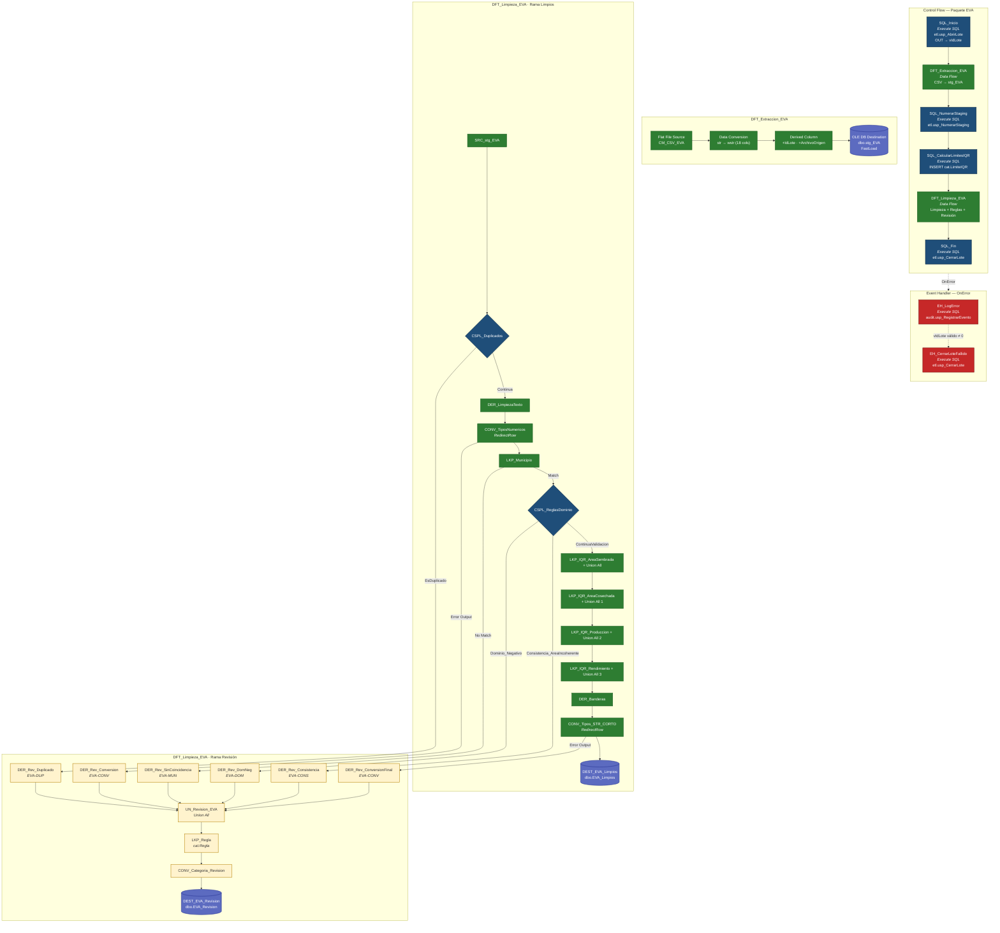

# Resumen técnico completo — Paquete SSIS `EVA`

> Solución EVA (Evaluaciones Agropecuarias Municipales) end-to-end: apertura de lote → extracción cruda del CSV → numeración de filas de staging → cálculo de límites IQR por cultivo → limpieza/validación/atipicidad → carga a `dbo.EVA_Limpios` + carga a `dbo.EVA_Revision` → cierre de lote. Incluye manejo de errores global con logging y cierre de lote fallido.

---

## 1. Visión general

`EVA` es un paquete SSIS (SQL Server 2025) que procesa el dataset **EVA (Evaluaciones Agropecuarias Municipales)** desde un CSV UTF-8 hacia `Wololo_ETL`. Aplica un patrón de **staging + limpieza + revisión** con reglas de calidad parametrizadas por lote (`IdLote`), versiones de reglas (`ReglasVersion`) y tipología (`REAL` vs prueba). Reutiliza infraestructura común con `FAOSTAT` (`etl.usp_AbrirLote`, `etl.usp_CerrarLote`, `audit.usp_RegistrarEvento`).

**Cadena de Control Flow (orden real):**

```
SQL_Inicio → DFT_Extraccion_EVA → SQL_NumerarStaging → SQL_CalcularLimitesIQR → DFT_Limpieza_EVA → SQL_Fin
```

**Manejo de error:** Event Handler `OnError` a nivel de paquete → `EH_LogError` → (si hay `IdLote` válido) → `EH_CerrarLoteFallido`.

---

## 2. Parámetros y variables

### 2.1 Project.params (compartidos con `FAOSTAT.dtsx`)

| Name | Data type | Value | Sensitive | Required |
|---|---|---|---|---|
| `pRutaCsv` | String | Ruta al CSV de origen | False | False |
| `pLoteClave` | String | Clave del lote (ej. `EVA-I1`) | False | False |
| `pIteracion` | Int32 | 1 | False | False |
| `pReglasVersion` | String | `v1` | False | False |

### 2.2 Variables de paquete (scope `EVA`)

| Name | Data type | Value | Uso |
|---|---|---|---|
| `vIdLote` | Int32 | 0 | Output de `usp_AbrirLote`. Alimenta filtros de `stg_EVA`, los `SqlCommand` de los Lookups IQR (vía PropertyExpression), y todos los `usp_*` posteriores. |
| `vDataset` | String | `EVA` | Se pasa a `usp_AbrirLote` y `audit.Log`. |
| `vTipo` | String | `REAL` | Se pasa a `usp_AbrirLote` (REAL vs prueba). |

### 2.3 Variables del Event Handler `OnError`

| Name | Scope | Data type | Value | ReadOnly |
|---|---|---|---|---|
| `System::Propagate` | System | Bool | `-1` | — |
| `vAccionError` | User | String | `ERROR_PAQUETE` | No |
| `vMecanismoError` | User | String | `PAQUETE` | Sí |
| `vTipoActorError` | User | String | `SSIS` | Sí |

---

## 3. Connection Managers

| Nombre | Tipo | Detalle |
|---|---|---|
| `localhost` | OLE DB | `Data Source=localhost; Initial Catalog=Wololo_ETL; Provider=MSOLEDBSQL.1; Integrated Security=SSPI; Auto Translate=False; Application Name=SSIS-EVA-{GUID}localhost;`. `ConnectRetryCount=1`, `ConnectRetryInterval=5`. |
| `CM_CSV_EVA` | Flat File | UTF-8 (codepage 65001), delimitado por `,`, calificador de texto `"`, `HeaderRowDelimiter=LF`, `RowDelimiter` vacío, columnas en la primera fila. 18 columnas. **Descripción:** *"Origen crudo de EVA (Evaluaciones Agropecuarias Municipales). CSV en UTF-8 … 48.932 filas / 18 columnas. Alimenta dbo.stg_EVA sin alterar los valores originales; la limpieza ocurre en el Data Flow de transformación."* |

**Ruta del CSV:** `C:\Users\Jonat\Documents\Github\Mineria-de-Datos\app\data\eva_basicos_colombia.csv`

---

## 4. Control Flow — 6 pasos

### 4.1 Mapa de precedencias

| Constraint | From | To | LogicalAnd |
|---|---|---|---|
| `Constraint` | `SQL_Inicio` | `DFT_Extraccion_EVA` | True |
| `Constraint 3` | `DFT_Extraccion_EVA` | `SQL_NumerarStaging` | True |
| `Constraint 4` | `SQL_NumerarStaging` | `SQL_CalcularLimitesIQR` | True |
| `Constraint 2` | `SQL_CalcularLimitesIQR` | `DFT_Limpieza_EVA` | True |
| `Constraint 1` | `DFT_Limpieza_EVA` | `SQL_Fin` | True |

Todas son de tipo Success. No hay constraints condicionales en el Control Flow (el ruteo por excepción se resuelve vía `OnError`).

---

### 4.2 Execute SQL Task — `SQL_Inicio`

| Propiedad | Valor |
|---|---|
| Connection | `localhost` (OLE DB) |
| SQLSourceType | Direct input |
| SQLStatement | `{call etl.usp_AbrirLote(?, ?, ?, ?, ?, ?, ?, ?, ?, ?)}` |

**Parameter Mapping** (10 parámetros):

| # | Variable | Direction | Data Type | Size |
|---|---|---|---|---|
| 0 | `$Project::pLoteClave` | Input | `129` (NVARCHAR) | 60 |
| 1 | `User::vDataset` | Input | `129` | 12 |
| 2 | `$Project::pIteracion` | Input | `3` (I4) | -1 |
| 3 | `$Project::pReglasVersion` | Input | `129` | 10 |
| 4 | `User::vTipo` | Input | `129` | 10 |
| 5 | `$Project::pRutaCsv` | Input | `129` | 260 |
| 6 | `System::PackageName` | Input | `129` | 128 |
| 7 | `System::TaskName` | Input | `129` | 128 |
| 8 | `System::ExecutionInstanceGUID` | Input | `129` | 50 |
| 9 | `User::vIdLote` | **Output** | `3` (I4) | -1 |

**Función:**
- Si `LoteClave` no existe → crea lote + registra `LOTE_ABIERTO` en `audit.Log`. Devuelve `IdLote`.
- Si ya existe → **borra en cascada** lo cargado por ese lote + registra `LOTE_REABIERTO`. Idempotente por clave de lote.

---

### 4.3 Data Flow Task — `DFT_Extraccion_EVA`

**Cadena:**

```
Flat File Source (CM_CSV_EVA)
  → Data Conversion (18 cols str → wstr)
  → Derived Column (+IdLote +ArchivoOrigen)
  → OLE DB Destination (dbo.stg_EVA, Fast Load)
```

#### 4.3.1 Flat File Source

- **Connection:** `CM_CSV_EVA`. `RetainNulls=false`. `FileNameColumnName` vacío.
- 18 columnas `str` (ANSI 65001), `FastParse=false`, `UseBinaryFormat=false`, `FailComponent` en error/truncamiento.

| # | Columna | Length | # | Columna | Length |
|---|---|---|---|---|---|
| 1 | `CodigoDeptoDane` | 50 | 10 | `Periodo` | 50 |
| 2 | `Departamento` | 255 | 11 | `AreaSembrada` | 50 |
| 3 | `CodigoMunicipioDane` | 50 | 12 | `AreaCosechada` | 50 |
| 4 | `Municipio` | 255 | 13 | `Produccion` | 50 |
| 5 | `GrupoCultivo` | 255 | 14 | `Rendimiento` | 50 |
| 6 | `Subgrupo` | 255 | 15 | `CicloCultivo` | 255 |
| 7 | `Cultivo` | 255 | 16 | `EstadoFisico` | 255 |
| 8 | `DesagregacionCultivo` | 255 | 17 | `CodigoCultivo` | 50 |
| 9 | `Anio` | 50 | 18 | `NombreCientifico` | 255 |

#### 4.3.2 Data Conversion

Convierte las 18 columnas `str` (ANSI 65001) → `wstr` (Unicode). Mismo nombre de salida. `FastParse=false`, `FailComponent` en error/truncamiento.

#### 4.3.3 Derived Column

| Nombre | Data type | Expression |
|---|---|---|
| `IdLote` | i4 | `(DT_I4)@[User::vIdLote]` |
| `ArchivoOrigen` | wstr(260) | `(DT_WSTR,260)@[$Project::pRutaCsv]` |

#### 4.3.4 OLE DB Destination — `dbo.stg_EVA`

| Propiedad | Valor |
|---|---|
| AccessMode | `3` (OpenRowset) |
| OpenRowset | `[dbo].[stg_EVA]` |
| FastLoadOptions | `TABLOCK,CHECK_CONSTRAINTS` |
| FastLoadKeepIdentity / KeepNulls | false / false |
| FastLoadMaxInsertCommitSize | `2147483647` |
| ErrorRowDisposition | `FailComponent` |

Mapea las 18 columnas + `IdLote` + `ArchivoOrigen`. **`<ignore>`**: `IdStg`, `NumeroFila`, `FechaCreacion`, `FechaActualizacion`.

**Resultado esperado:** 48.932 filas en `stg_EVA` para el lote actual.

---

### 4.4 Execute SQL Task — `SQL_NumerarStaging`

| Propiedad | Valor |
|---|---|
| Connection | `localhost` (OLE DB) |
| SQLSourceType | Direct input |
| SQLStatement | `{call etl.usp_NumerarStaging(?)}` |

**Parameter Mapping:**

| # | Variable | Direction | Data Type |
|---|---|---|---|
| 0 | `User::vIdLote` | Input | `3` (I4) |

**Función:** numera (`NumeroFila`) las filas de `dbo.stg_EVA` para el `IdLote` indicado, alineado con el orden físico de carga desde el Flat File Source. Habilita trazabilidad por número de fila en las tablas de revisión.

---

### 4.5 Execute SQL Task — `SQL_CalcularLimitesIQR`

| Propiedad | Valor |
|---|---|
| Connection | `localhost` (OLE DB) |
| SQLSourceType | Direct input |
| SQLStatement | CTE con `PERCENTILE_CONT(0.25/0.75)` agrupado por `Cultivo`, sobre `stg_EVA WHERE IdLote = ?`, que inserta 4×N filas en `cat.LimiteIQR`. |

**Estructura del SQL (resumen):**

```sql
;WITH Base AS (
    SELECT
        LTRIM(RTRIM(Cultivo)) AS Cultivo,
        TRY_CONVERT(DECIMAL(14,2), REPLACE(REPLACE(LTRIM(RTRIM(AreaSembrada)),  '.', ''), ',', '.')) AS AreaSembrada,
        TRY_CONVERT(DECIMAL(14,2), REPLACE(REPLACE(LTRIM(RTRIM(AreaCosechada)), '.', ''), ',', '.')) AS AreaCosechada,
        TRY_CONVERT(DECIMAL(16,2), REPLACE(REPLACE(LTRIM(RTRIM(Produccion)),    '.', ''), ',', '.')) AS Produccion,
        TRY_CONVERT(DECIMAL(12,2), REPLACE(REPLACE(LTRIM(RTRIM(Rendimiento)),   '.', ''), ',', '.')) AS Rendimiento
    FROM dbo.stg_EVA
    WHERE IdLote = ?
),
Cuartiles AS (
    SELECT DISTINCT
        Cultivo,
        COUNT(*) OVER (PARTITION BY Cultivo) AS N_AreaSembrada,
        PERCENTILE_CONT(0.25) WITHIN GROUP (ORDER BY AreaSembrada) OVER (PARTITION BY Cultivo) AS Q1_AreaSembrada,
        PERCENTILE_CONT(0.75) WITHIN GROUP (ORDER BY AreaSembrada) OVER (PARTITION BY Cultivo) AS Q3_AreaSembrada,
        -- ... análogo para AreaCosechada, Produccion, Rendimiento ...
    FROM Base
)
INSERT cat.LimiteIQR (IdLote, Dataset, Campo, GrupoClave, N, Q1, Q3, LimiteInferior, LimiteSuperior)
SELECT ?, 'EVA', 'AreaSembrada', Cultivo, N_AreaSembrada, Q1_AreaSembrada, Q3_AreaSembrada,
       Q1_AreaSembrada - 1.5*(Q3_AreaSembrada - Q1_AreaSembrada),
       Q3_AreaSembrada + 1.5*(Q3_AreaSembrada - Q1_AreaSembrada) FROM Cuartiles
UNION ALL SELECT ?, 'EVA', 'AreaCosechada', ... FROM Cuartiles
UNION ALL SELECT ?, 'EVA', 'Produccion',    ... FROM Cuartiles
UNION ALL SELECT ?, 'EVA', 'Rendimiento',   ... FROM Cuartiles;
```

**Parameter Mapping** (5 `?`):

| # | Variable | Direction | Data Type |
|---|---|---|---|
| 0–4 | `User::vIdLote` | Input | `3` (I4) |

**Regla IQR:** `LimiteInferior = Q1 − 1.5·(Q3−Q1)` · `LimiteSuperior = Q3 + 1.5·(Q3−Q1)`.

**Resultado esperado:** 24 filas en `cat.LimiteIQR` (6 cultivos × 4 campos).

---

### 4.6 Data Flow Task — `DFT_Limpieza_EVA`

**Cadena completa (según `<paths>`):**

```
SRC_stg_EVA
  └─▶ CSPL_Duplicados
        ├─ EsDuplicado ─────────────────────▶ DER_Rev_Duplicado ──────────┐
        └─ Continua ──▶ DER_LimpiezaTexto                                   │
                          └─▶ CONV_TiposNumericos                          │
                                ├─ Error ──▶ DER_Rev_Conversion ───────────┤
                                └─ OK ──▶ LKP_Municipio                     │
                                            ├─ No Match ─▶ DER_Rev_SinCoincidencia ─┤
                                            └─ Match ──▶ CSPL_ReglasDominio         │
                                                          ├─ Dominio_Negativo ─────▶ DER_Rev_DomNeg ──┤
                                                          ├─ Consistencia_AreaIncoherente ▶ DER_Rev_Consistencia ─┤
                                                          └─ ContinuaValidacion                          │
                                                              └─▶ LKP_IQR_AreaSembrada (+Union All)      │
                                                                  └─▶ LKP_IQR_AreaCosechada (+Union All 1)│
                                                                      └─▶ LKP_IQR_Produccion (+Union All 2)│
                                                                          └─▶ LKP_IQR_Rendimiento (+Union All 3)│
                                                                              └─▶ DER_Banderas          │
                                                                                  └─▶ CONV_Tipos_STR_CORTO│
                                                                                        ├─ Error ─▶ DER_Rev_ConversionFinal ─┤
                                                                                        └─ OK ────▶ DEST_EVA_Limpios         │
                                                                                                                              ▼
                                                                                     UN_Revision_EVA (Union All de 5 ramas)
                                                                                        └─▶ LKP_Regla (cat.Regla)
                                                                                              └─▶ CONV_Categoria_Revision
                                                                                                    └─▶ DEST_EVA_Revision
```

**Salidas que arman la rama de Revisión (5 + 1):**
1. `CSPL_Duplicados.EsDuplicado` → `DER_Rev_Duplicado` → `UN_Revision_EVA`
2. `CONV_TiposNumericos.Error Output` → `DER_Rev_Conversion` → `UN_Revision_EVA`
3. `LKP_Municipio.No Match` → `DER_Rev_SinCoincidencia` → `UN_Revision_EVA`
4. `CSPL_ReglasDominio.Dominio_Negativo` → `DER_Rev_DomNeg` → `UN_Revision_EVA`
5. `CSPL_ReglasDominio.Consistencia_AreaIncoherente` → `DER_Rev_Consistencia` → `UN_Revision_EVA`
6. `CONV_Tipos_STR_CORTO.Error Output` → `DER_Rev_ConversionFinal` → `UN_Revision_EVA`

Además, `UN_Revision_EVA` recibe una **7ª entrada** que trae el contexto completo de filas provenientes de `Union All 3` (post-IQR / pre-`DER_Banderas`) para uso como "copia" del flujo si se requiriera. *(Nota: La 7ª ruta es la que va desde `DER_Rev_ConversionFinal`; el diseño contempla 6 ramas activas + 1 dangling `Input 6`.)*

**PropertyExpressions a nivel de DFT (parametrización de Lookups IQR):**

```xml
"SELECT GrupoClave, LimiteInferior, LimiteSuperior
 FROM cat.LimiteIQR
 WHERE IdLote = " + (DT_WSTR,10)@[User::vIdLote] + "
   AND Dataset = 'EVA' AND Campo = '<Campo>'"
```

Registradas para `LKP_IQR_AreaSembrada`, `LKP_IQR_AreaCosechada`, `LKP_IQR_Produccion`, `LKP_IQR_Rendimiento`.

#### 4.6.1 OLE DB Source — `SRC_stg_EVA`

| Propiedad | Valor |
|---|---|
| AccessMode | `2` (SQL command) |
| ParameterMapping | `Parameter0:Input,{A9063809-9B62-4A13-B2E5-64D249315269}` → `User::vIdLote` |

```sql
SELECT *,
  COUNT(*) OVER (PARTITION BY LTRIM(RTRIM(CodigoMunicipioDane)), LTRIM(RTRIM(CodigoCultivo)),
                               LTRIM(RTRIM(DesagregacionCultivo)), LTRIM(RTRIM(Anio)), LTRIM(RTRIM(Periodo))) AS TotalEnGrupo,
  ROW_NUMBER() OVER (PARTITION BY LTRIM(RTRIM(CodigoMunicipioDane)), LTRIM(RTRIM(CodigoCultivo)),
                                    LTRIM(RTRIM(DesagregacionCultivo)), LTRIM(RTRIM(Anio)), LTRIM(RTRIM(Periodo))
                     ORDER BY IdStg) AS OrdenEnGrupo
FROM dbo.stg_EVA
WHERE IdLote = ?
```

**Salida (26 columnas):** `IdStg`, `IdLote`, `ArchivoOrigen`, `NumeroFila`, `CodigoDeptoDane`, `Departamento`, `CodigoMunicipioDane`, `Municipio`, `GrupoCultivo`, `Subgrupo`, `Cultivo`, `DesagregacionCultivo`, `Anio`, `Periodo`, `AreaSembrada`, `AreaCosechada`, `Produccion`, `Rendimiento`, `CicloCultivo`, `EstadoFisico`, `CodigoCultivo`, `NombreCientifico`, `FechaCreacion`, `FechaActualizacion`, `TotalEnGrupo`, `OrdenEnGrupo`.

#### 4.6.2 Conditional Split — `CSPL_Duplicados`

| Order | Output | Expression |
|---|---|---|
| 0 | `EsDuplicado` | `TotalEnGrupo > 1 && OrdenEnGrupo > 1` |
| — | `Continua` (default) | resto |

#### 4.6.3 Derived Column — `DER_LimpiezaTexto`

Todas las columnas son **nuevas**:

| Nombre | Tipo | Expresión | Propósito |
|---|---|---|---|
| `CodigoDeptoDaneClave` | wstr(50) | `TRIM(CodigoDeptoDane)` | clave sin espacios |
| `CodigoMunicipioDaneClave` | wstr(50) | `TRIM(CodigoMunicipioDane)` | join con `LKP_Municipio` |
| `MunicipioClave` | wstr(255) | `UPPER(TRIM(Municipio))` | normalización |
| `CultivoClave` | wstr(255) | `TRIM(Cultivo)` | join con Lookups IQR |
| `DesagregacionClave` | wstr(255) | `TRIM(DesagregacionCultivo)` | destino |
| `AnioClave` | wstr(50) | `TRIM(Anio)` | antes de I2 |
| `PeriodoClave` | wstr(50) | `UPPER(TRIM(Periodo))` | destino |
| `AreaSembradaTexto` | wstr(50) | `REPLACE(REPLACE(TRIM(AreaSembrada),".",""),",",".")` | quita miles y cambia coma decimal |
| `AreaCosechadaTexto` | wstr(50) | idem `AreaCosechada` | idem |
| `ProduccionTexto` | wstr(50) | idem `Produccion` | idem |
| `RendimientoTexto` | wstr(50) | idem `Rendimiento` | idem |
| `CodigoCultivoClave` | wstr(50) | `TRIM(CodigoCultivo)` | auxiliar |

**Regla numérica doble REPLACE:** `"1.234,56"` → `"1234.56"`.

#### 4.6.4 Data Conversion #1 — `CONV_TiposNumericos`

| Input | Output | Tipo | Scale | Error/Truncation |
|---|---|---|---|---|
| `AreaSembradaTexto` | `AreaSembradaNum` | `decimal` | 2 | **RedirectRow** |
| `AreaCosechadaTexto` | `AreaCosechadaNum` | `decimal` | 2 | **RedirectRow** |
| `ProduccionTexto` | `ProduccionNum` | `decimal` | 2 | **RedirectRow** |
| `RendimientoTexto` | `RendimientoNum` | `decimal` | 2 | **RedirectRow** |
| `AnioClave` | `AnioNum` | `i2` | — | **RedirectRow** |

**Error Output → `DER_Rev_Conversion`.**

#### 4.6.5 Lookup — `LKP_Municipio`

| Propiedad | Valor |
|---|---|
| NoMatchBehavior | 1 = Redirect rows to no match output |
| SqlCommand | `SELECT CAST(CodigoMunicipioDane AS NVARCHAR(5)) AS CodigoMunicipioDane, CodigoDeptoDane, Departamento, Municipio FROM cat.Municipio` |
| Join | `CodigoMunicipioDaneClave` = `CodigoMunicipioDane` |

| Output | Tipo | Length | CopyFrom |
|---|---|---|---|
| `CodigoDeptoDaneOficial` | str(1252) | 2 | `CodigoDeptoDane` |
| `DepartamentoOficial` | wstr | 100 | `Departamento` |
| `MunicipioOficial` | wstr | 150 | `Municipio` |

#### 4.6.6 Conditional Split — `CSPL_ReglasDominio`

| Order | Output | Expression |
|---|---|---|
| 0 | `Dominio_Negativo` | `AreaSembradaNum < 0 \|\| AreaCosechadaNum < 0 \|\| ProduccionNum < 0 \|\| RendimientoNum < 0` |
| 1 | `Consistencia_AreaIncoherente` | `AreaCosechadaNum > AreaSembradaNum` |
| — | `ContinuaValidacion` (default) | resto |

#### 4.6.7 Lookups IQR ×4

Todos comparten:
- **ConnectionType** = OLE DB, **CacheType** = Full cache, **NoMatchBehavior** = 1.
- **SqlCommand** parametrizado por `PropertyExpression` (ver 4.6).
- **ReferenceMetadataXml:** `GrupoClave (DT_WSTR, 200)`, `LimiteInferior (DT_NUMERIC, 20, 4)`, `LimiteSuperior (DT_NUMERIC, 20, 4)`.
- `TreatDuplicateKeysAsError = false`, `DefaultCodePage = 1252`.

| Lookup | Campo | Join (input = ref) | Output | Precisión |
|---|---|---|---|---|
| `LKP_IQR_AreaSembrada` | `AreaSembrada` | `CultivoClave` = `GrupoClave` | `LimInf_AS`, `LimSup_AS` | numeric(20,4) |
| `LKP_IQR_AreaCosechada` | `AreaCosechada` | `CultivoClave` = `GrupoClave` | `LimInf_AC`, `LimSup_AC` | numeric(20,4) |
| `LKP_IQR_Produccion` | `Produccion` | `CultivoClave` = `GrupoClave` | `LimInf_PR`, `LimSup_PR` | numeric(20,4) |
| `LKP_IQR_Rendimiento` | `Rendimiento` | `CultivoClave` = `GrupoClave` | `LimInf_RE`, `LimSup_RE` | numeric(20,4) |

Cada Lookup va seguido de un **Union All** que junta Match + No Match (el No Match conserva el flujo con límites en `NULL`).

#### 4.6.8 Derived Column — `DER_Banderas`

| Bandera | Expression (resumen) |
|---|---|
| `FlagAtipicoAreaSembrada` | `(ISNULL(LimInf_AS) \|\| ISNULL(LimSup_AS)) ? 0 : (AreaSembradaNum < LimInf_AS \|\| AreaSembradaNum > LimSup_AS) ? 1 : 0` |
| `FlagAtipicoAreaCosechada` | idem con `_AC` |
| `FlagAtipicoProduccion` | idem con `_PR` |
| `FlagAtipicoRendimiento` | idem con `_RE` |
| `FlagAreaIncoherente` | `(DT_BOOL)0` (constante; las incoherentes ya salieron por `CSPL_ReglasDominio`) |

**Regla:** sin límites IQR (No Match) → flag `0`; con límites → `1` si fuera de `[LimInf, LimSup]`.

#### 4.6.9 Data Conversion #2 — `CONV_Tipos_STR_CORTO`

| Input | Output | Tipo | Length | Error/Truncation |
|---|---|---|---|---|
| `CodigoDeptoDaneOficial` | `CodigoDeptoDaneStr` | str(1252) | 2 | **RedirectRow** |
| `CodigoMunicipioDaneClave` | `CodigoMunicipioDaneStr` | str(1252) | 5 | **RedirectRow** |
| `PeriodoClave` | `PeriodoStr` | str(1252) | 5 | **RedirectRow** |
| `CodigoCultivo` | `CodigoCultivoStr` | str(1252) | 20 | **RedirectRow** |
| `GrupoCultivo` | `GrupoCultivoCorto` | wstr | 100 | **RedirectRow** |
| `Subgrupo` | `SubgrupoCorto` | wstr | 100 | **RedirectRow** |
| `CultivoClave` | `CultivoCorto` | wstr | 60 | **RedirectRow** |
| `DesagregacionClave` | `DesagregacionCorta` | wstr | 150 | **RedirectRow** |
| `CicloCultivo` | `CicloCultivoCorto` | wstr | 30 | **RedirectRow** |
| `EstadoFisico` | `EstadoFisicoCorto` | wstr | 50 | **RedirectRow** |
| `NombreCientifico` | `NombreCientificoCorto` | wstr | 150 | **RedirectRow** |
| `MunicipioOficial` | `MunicipioCorto` | wstr | 150 | **RedirectRow** |

**Error Output → `DER_Rev_ConversionFinal`.**

#### 4.6.10 OLE DB Destination — `dbo.EVA_Limpios`

| Propiedad | Valor |
|---|---|
| AccessMode | `3` (OpenRowset) |
| OpenRowset | `[dbo].[EVA_Limpios]` |
| FastLoadOptions | `TABLOCK,CHECK_CONSTRAINTS` |
| FastLoadKeepIdentity / KeepNulls | false / false |
| FastLoadMaxInsertCommitSize | `2147483647` |
| ErrorRowDisposition | `FailComponent` |

| Destino | Origen |
|---|---|
| `IdEvaLimpio` | `<ignore>` (IDENTITY) |
| `IdLote` | `IdLote` |
| `IdStg` | `IdStg` |
| `CodigoDeptoDane` | `CodigoDeptoDaneStr` |
| `Departamento` | `DepartamentoOficial` |
| `CodigoMunicipioDane` | `CodigoMunicipioDaneStr` |
| `Municipio` | `MunicipioCorto` |
| `GrupoCultivo` | `GrupoCultivoCorto` |
| `Subgrupo` | `SubgrupoCorto` |
| `Cultivo` | `CultivoCorto` |
| `DesagregacionCultivo` | `DesagregacionCorta` |
| `Anio` | `AnioNum` |
| `Periodo` | `PeriodoStr` |
| `AreaSembrada` | `AreaSembradaNum` |
| `AreaCosechada` | `AreaCosechadaNum` |
| `Produccion` | `ProduccionNum` |
| `Rendimiento` | `RendimientoNum` |
| `CicloCultivo` | `CicloCultivoCorto` |
| `EstadoFisico` | `EstadoFisicoCorto` |
| `CodigoCultivo` | `CodigoCultivoStr` |
| `NombreCientifico` | `NombreCientificoCorto` |
| `FlagAreaIncoherente` | `FlagAreaIncoherente` |
| `FlagAtipicoAreaSembrada` | `FlagAtipicoAreaSembrada` |
| `FlagAtipicoAreaCosechada` | `FlagAtipicoAreaCosechada` |
| `FlagAtipicoProduccion` | `FlagAtipicoProduccion` |
| `FlagAtipicoRendimiento` | `FlagAtipicoRendimiento` |
| `FechaCreacion` | `<ignore>` |
| `FechaActualizacion` | `<ignore>` |

---

### 4.7 Rama de Revisión — componentes dedicados

#### 4.7.1 Derived Columns `DER_Rev_*` (5 + 1)

Todos agregan 5 columnas: `Categoria`, `Motivo`, `CampoAfectado`, `ValorOriginal`, `ReglaCodigo`.

| Componente | Categoria | ReglaCodigo | Motivo / CampoAfectado / ValorOriginal |
|---|---|---|---|
| `DER_Rev_Duplicado` | `DUPLICADO` | `EVA-DUP` | Motivo: `"Fila duplicada en el lote: misma clave (posición X de N)."` · Campo: `CodigoMunicipioDane,CodigoCultivo,DesagregacionCultivo,Anio,Periodo` · Valor: `NULL` |
| `DER_Rev_Conversion` | `ERROR_CONVERSION` | `EVA-CONV` | Motivo: `"Error de conversión numérica. ErrorCode=… ErrorColumn=…"` · Campo: `AreaSembrada,AreaCosechada,Produccion,Rendimiento,Anio` · Valor: `AreaSembradaTexto + "," + … + AnioClave` |
| `DER_Rev_DomNeg` | `DOMINIO` | `EVA-DOM` | Motivo: `"Valor negativo en <Campo>: <Valor>"` · Campo: primer campo `< 0` (cascada) · Valor: el valor negativo |
| `DER_Rev_Consistencia` | `CONSISTENCIA` | `EVA-CONS` | Motivo: `"AreaCosechada (X) mayor que AreaSembrada (Y)."` · Campo: `AreaCosechada,AreaSembrada` · Valor: `X / Y` |
| `DER_Rev_SinCoincidencia` | `SIN_COINCIDENCIA` | `EVA-MUN` | Motivo: `"CodigoMunicipioDane 'X' no existe en cat.Municipio (DIVIPOLA)."` · Campo: `CodigoMunicipioDane` · Valor: `CodigoMunicipioDaneClave` |
| `DER_Rev_ConversionFinal` | `ERROR_CONVERSION` | `EVA-CONV` | Motivo: `"Error de conversión final de texto en alguno de los 12 campos. ErrorCode=… ErrorColumn=…"` · Campo: `CamposTextoCorto` · Valor: `NULL` |

Todos usan `FailComponent` en error/truncamiento.

#### 4.7.2 Union All — `UN_Revision_EVA`

Une 5 ramas activas (más 1 dangling `Input 6`):
- **Input 1** ← `DER_Rev_Duplicado`
- **Input 2** ← `DER_Rev_Conversion`
- **Input 3** ← `DER_Rev_SinCoincidencia`
- **Input 4** ← `DER_Rev_DomNeg`
- **Input 5** ← `DER_Rev_Consistencia`
- **Input 7** ← `DER_Rev_ConversionFinal`

Salida: contexto completo de la fila (`IdStg`, `IdLote`, `ArchivoOrigen`, `NumeroFila`, `CodigoDeptoDane`…`NombreCientifico`, `FechaCreacion`, `FechaActualizacion`, `TotalEnGrupo`, `OrdenEnGrupo`) + los 5 metadatos de Revisión (`Categoria`, `Motivo`, `CampoAfectado`, `ValorOriginal`, `ReglaCodigo`) con longitudes normalizadas a los máximos (`Categoria` wstr(50), `Motivo` wstr(111), `CampoAfectado` wstr(161), `ValorOriginal` wstr(255), `ReglaCodigo` wstr(8)).

#### 4.7.3 Lookup — `LKP_Regla`

| Propiedad | Valor |
|---|---|
| NoMatchBehavior | 1 = Redirect rows to no match output |
| SqlCommand | `SELECT IdRegla, CAST(Codigo AS NVARCHAR(8)) AS Codigo FROM cat.Regla WHERE Familia = 'EVA' AND Activa = 1 AND ReglasVersion = 'v1'` |
| Join | `ReglaCodigo` (input) = `Codigo` (ref) |

| Output | Tipo | CopyFrom |
|---|---|---|
| `IdRegla` | i4 | `IdRegla` |

**ParameterMap:** `#{…UN_Revision_EVA…ReglaCodigo};`

> ⚠️ Nota: `ReglasVersion = 'v1'` está fijo en el SQL; considerar parametrizar con `@[$Project::pReglasVersion]` si aplica a la variabilidad de reglas por lote.

#### 4.7.4 Data Conversion — `CONV_Categoria_Revision`

| Input | Output | Tipo | Length |
|---|---|---|---|
| `Categoria` (wstr 50) | `CategoriaStr` | str(1252) | 20 |

**Error Output:** `FailComponent` (sin rama de error conectada).

#### 4.7.5 OLE DB Destination — `dbo.EVA_Revision`

| Propiedad | Valor |
|---|---|
| AccessMode | `3` (OpenRowset) |
| OpenRowset | `[dbo].[EVA_Revision]` |
| FastLoadOptions | `TABLOCK,CHECK_CONSTRAINTS` |
| FastLoadKeepIdentity / KeepNulls | false / false |
| FastLoadMaxInsertCommitSize | `2147483647` |
| ErrorRowDisposition | `FailComponent` |

**Mapeo Destino ← Origen:**

| Destino (EVA_Revision) | Origen |
|---|---|
| `IdEvaRevision` | `<ignore>` (IDENTITY) |
| `IdLote` | `IdLote` |
| `IdStg` | `IdStg` |
| `IdRegla` | `IdRegla` (Lookup cat.Regla) |
| `Categoria` | `CategoriaStr` |
| `Motivo` | `Motivo` |
| `CampoAfectado` | `CampoAfectado` |
| `ValorOriginal` | `ValorOriginal` |
| `CodigoDeptoDane` | `CodigoDeptoDane` |
| `Departamento` | `Departamento` |
| `CodigoMunicipioDane` | `CodigoMunicipioDane` |
| `Municipio` | `Municipio` |
| `GrupoCultivo` | `GrupoCultivo` |
| `Subgrupo` | `Subgrupo` |
| `Cultivo` | `Cultivo` |
| `DesagregacionCultivo` | `DesagregacionCultivo` |
| `Anio` | `Anio` |
| `Periodo` | `Periodo` |
| `AreaSembrada` | `AreaSembrada` |
| `AreaCosechada` | `AreaCosechada` |
| `Produccion` | `Produccion` |
| `Rendimiento` | `Rendimiento` |
| `CicloCultivo` | `CicloCultivo` |
| `EstadoFisico` | `EstadoFisico` |
| `CodigoCultivo` | `CodigoCultivo` |
| `NombreCientifico` | `NombreCientifico` |
| `EstadoRevision` | `<ignore>` (default) |
| `Resolucion` | `<ignore>` |
| `RevisadoPor` | `<ignore>` |
| `FechaRevision` | `<ignore>` |
| `FechaCreacion` | `<ignore>` (default) |
| `FechaActualizacion` | `<ignore>` |

---

### 4.8 Execute SQL Task — `SQL_Fin`

| Propiedad | Valor |
|---|---|
| Connection | `localhost` (OLE DB) |
| SQLSourceType | Direct input |
| SQLStatement | `{call etl.usp_CerrarLote(?, DEFAULT, DEFAULT, DEFAULT, DEFAULT, ?, ?, ?)}` |

**Parameter Mapping:**

| # | Variable | Direction | Data Type | Size |
|---|---|---|---|---|
| 0 | `User::vIdLote` | Input | `3` (I4) | -1 |
| 1 | `System::PackageName` | Input | `130` (NVARCHAR) | 128 |
| 2 | `System::TaskName` | Input | `130` | 128 |
| 3 | `System::ExecutionInstanceGUID` | Input | `130` | 50 |

**Función:** cierra formalmente el lote (marca el estado final) y registra `LOTE_CERRADO` en `audit.Log`.

---

## 5. Event Handler — `OnError` (paquete)

Se dispara ante cualquier error no controlado en el paquete.

### 5.1 Executables

| Nombre | Tipo | SQL | Parámetros |
|---|---|---|---|
| `EH_LogError` | Execute SQL Task | `{call audit.usp_RegistrarEvento(?, ?, ?, DEFAULT, DEFAULT, DEFAULT, DEFAULT, DEFAULT, ?, ?, ?, ?, ?)}` | `Accion`, `ErrorDescription`, `IdLote`, `TipoActor`, `Mecanismo`, `PackageName`, `SourceName`, `ExecutionInstanceGUID` |
| `EH_CerrarLoteFallido` | Execute SQL Task | `{call etl.usp_CerrarLote(?, DEFAULT, DEFAULT, DEFAULT, DEFAULT, ?, ?, ?)}` | `IdLote`, `PackageName`, `TaskName`, `ExecutionInstanceGUID` |

**Parameter Mapping de `EH_LogError`:**

| # | Variable | Data Type | Size |
|---|---|---|---|
| 0 | `User::vAccionError` (`ERROR_PAQUETE`) | `130` | 30 |
| 1 | `System::ErrorDescription` | `130` | 500 |
| 2 | `User::vIdLote` | `3` | -1 |
| 3 | `User::vTipoActorError` (`SSIS`) | `130` | 10 |
| 4 | `User::vMecanismoError` (`PAQUETE`) | `130` | 15 |
| 5 | `System::PackageName` | `130` | 128 |
| 6 | `System::SourceName` | `130` | 128 |
| 7 | `System::ExecutionInstanceGUID` | `130` | 50 |

### 5.2 Precedencia interna del handler

| From | To | EvalOp | Expression |
|---|---|---|---|
| `EH_LogError` | `EH_CerrarLoteFallido` | `3` (Expression AND Constraint) | `!(ISNULL(@[User::vIdLote]) || @[User::vIdLote] == 0)` |

Es decir: **siempre** se loguea el error; **además** se cierra el lote fallido **solo** si `vIdLote` tiene un valor válido distinto de 0 (para no intentar cerrar lotes que nunca se abrieron).

---

## 6. Matriz de reglas de calidad

| # | Regla | Dónde se detecta | Categoría | Tabla destino | Flag en `EVA_Limpios` |
|---|---|---|---|---|---|
| 1 | Duplicados por `(municipio, cultivo, desagregación, año, periodo)` | `CSPL_Duplicados.EsDuplicado` → `DER_Rev_Duplicado` | `DUPLICADO` | `EVA_Revision` | — |
| 2 | Conversión texto→decimal inválida | `CONV_TiposNumericos.Error Output` → `DER_Rev_Conversion` | `ERROR_CONVERSION` | `EVA_Revision` | — |
| 3 | Municipio inexistente en `cat.Municipio` | `LKP_Municipio.No Match` → `DER_Rev_SinCoincidencia` | `SIN_COINCIDENCIA` | `EVA_Revision` | — |
| 4 | Valor negativo en alguna de las 4 métricas | `CSPL_ReglasDominio.Dominio_Negativo` → `DER_Rev_DomNeg` | `DOMINIO` | `EVA_Revision` | — |
| 5 | `ÁreaCosechada > ÁreaSembrada` | `CSPL_ReglasDominio.Consistencia_AreaIncoherente` → `DER_Rev_Consistencia` | `CONSISTENCIA` | `EVA_Revision` | — |
| 6 | Atípicos por IQR (1.5·RIC) por cultivo | `LKP_IQR_*` + `DER_Banderas` | (banderas) | `EVA_Limpios` | `FlagAtipico*` |
| 7 | Truncamiento/error en conversión final a CHAR/VARCHAR | `CONV_Tipos_STR_CORTO.Error Output` → `DER_Rev_ConversionFinal` | `ERROR_CONVERSION` | `EVA_Revision` | — |

---

## 7. Objetos de base de datos utilizados

| Esquema | Objeto | Uso |
|---|---|---|
| `etl` | `usp_AbrirLote` | Crear/reabrir lote y devolver `IdLote` |
| `etl` | `usp_NumerarStaging` | Asignar `NumeroFila` a filas de `stg_EVA` para el lote |
| `etl` | `usp_CerrarLote` | Cerrar lote (éxito o error) |
| `audit` | `usp_RegistrarEvento` | Registrar evento/error en `audit.Log` |
| `dbo` | `stg_EVA` | Landing crudo del CSV (48.932 filas por lote) |
| `dbo` | `EVA_Limpios` | Tabla de hechos limpios con banderas |
| `dbo` | `EVA_Revision` | Cola de revisión con metadatos de regla |
| `cat` | `Municipio` | Catálogo DIVIPOLA |
| `cat` | `LimiteIQR` | Límites IQR por `IdLote`/`Dataset`/`Campo`/`GrupoClave` |
| `cat` | `Regla` | Catálogo de reglas (`Familia=EVA`, `Activa=1`) |

---

## 8. Diagrama general del paquete



---

## 9. Notas de diseño y observaciones

1. **Idempotencia por lote:** `usp_AbrirLote` limpia en cascada lo cargado por el mismo `LoteClave` antes de re-ejecutar. Segunda corrida no duplica.
2. **Numeración de filas:** `SQL_NumerarStaging` corre después de la extracción y antes del cálculo de IQR; garantiza `NumeroFila` consistente para trazabilidad en `EVA_Revision`.
3. **Parametrización de Lookups IQR:** ya no hay `IdLote = 1` hardcodeado; las 4 consultas se arman con `@[User::vIdLote]` a través de `PropertyExpression` a nivel de `DFT_Limpieza_EVA`.
4. **RedirectRow en conversiones:** tanto `CONV_TiposNumericos` como `CONV_Tipos_STR_CORTO` redirigen errores/truncamientos por su Error Output, en vez de fallar el paquete.
5. **Rama de Revisión consolidada:** las 6 salidas "anómalas" (duplicado, error de conversión, sin coincidencia DIVIPOLA, dominio negativo, inconsistencia de área, error de conversión final de texto) se unifican en `UN_Revision_EVA`, se enriquecen con `IdRegla` vía `LKP_Regla`, se normaliza `Categoria` a `CHAR(20)` y se persisten en `dbo.EVA_Revision` con `EstadoRevision`, `Resolucion`, `RevisadoPor` y `FechaRevision` como campos pendientes de gestión manual.
6. **Manejo de error robusto:** el `OnError` loguea siempre (`EH_LogError`) y cierra el lote solo si hay `vIdLote` válido (`EH_CerrarLoteFallido`), evitando "cerrar" lotes fantasma.
7. **Cierre de lote explícito:** `SQL_Fin` invoca `usp_CerrarLote` para marcar el lote como exitoso al final del pipeline.
8. **Regla IQR:** implementada con `PERCENTILE_CONT(0.25/0.75) WITHIN GROUP` agrupado por `Cultivo`; los 4 campos (`AreaSembrada`, `AreaCosechada`, `Produccion`, `Rendimiento`) se almacenan en `cat.LimiteIQR` listos para que los Lookups IQR los consuman en el mismo lote.
9. **`FlagAreaIncoherente` constante `0`:** como las filas incoherentes se desvían a Revisión en `CSPL_ReglasDominio`, la bandera en `EVA_Limpios` siempre es 0; si en el futuro se decide dejar pasar alguna, habría que cambiar la expresión.

---

**Fin del documento.**