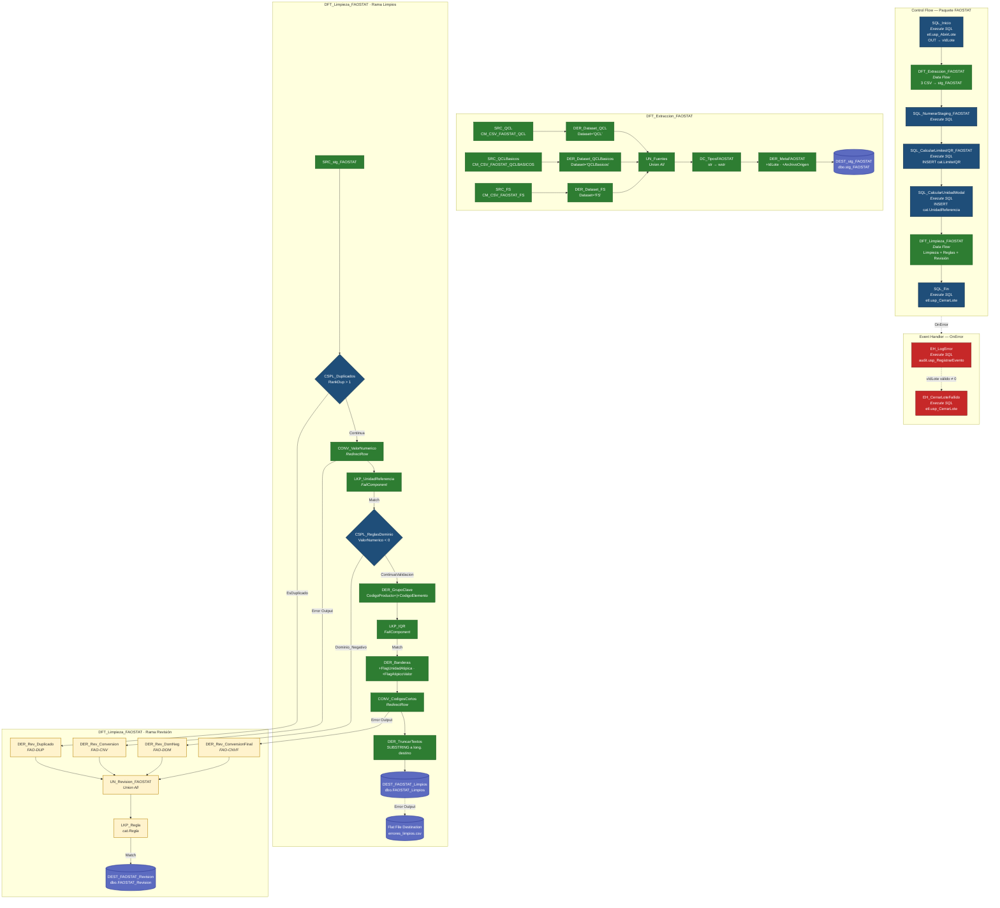

# Resumen técnico completo — Paquete SSIS `FAOSTAT`

> Solución **FAOSTAT** end-to-end: apertura de lote → extracción cruda de **3 CSV** (QCL, QCLBasicos, FS) hacia una única staging (`stg_FAOSTAT`) → numeración de filas → cálculo de límites IQR por `Producto|Elemento` → cálculo de **unidad modal** por `(Dataset, Producto, Elemento)` → limpieza/validación/atipicidad → carga a `dbo.FAOSTAT_Limpios` **y** a `dbo.FAOSTAT_Revision` → cierre de lote. Incluye **manejo de errores global** con logging en `audit.Log` y cierre de lote fallido, además de un **Flat File Destination** para volcar errores de inserción a `errores_limpios.csv`.

---

## 1. Visión general

`FAOSTAT` es un paquete SSIS (SQL Server 2025) que procesa **tres datasets simultáneos** (`QCL`, `QCLBasicos`, `FS`) desde CSVs UTF-8 hacia `Wololo_ETL`. Utiliza un patrón de **staging + limpieza + revisión** con reglas de calidad parametrizadas por lote (`IdLote`), versiones de reglas (`ReglasVersion`) y tipología (`REAL` vs prueba).

**Cadena de Control Flow (orden real):**

```
SQL_Inicio
  → DFT_Extraccion_FAOSTAT
    → SQL_NumerarStaging_FAOSTAT
      → SQL_CalcularLimitesIQR_FAOSTAT
        → SQL_CalcularUnidadModal
          → DFT_Limpieza_FAOSTAT
            → SQL_Fin
```

**Manejo de error:** ✅ **Implementado** mediante Event Handler `OnError` de paquete → `EH_LogError` (registra en `audit.Log`) → condicionado a `IdLote` válido → `EH_CerrarLoteFallido` (cierre de lote fallido).

---

## 2. Parámetros y variables

### 2.1 Project.params (referenciados en el paquete)

| Name | Uso |
|---|---|
| `pRutaCsvFaostatQCL` | Ruta al CSV de QCL |
| `pRutaCsvFaostatQCLBasicos` | Ruta al CSV de QCL básicos |
| `pRutaCsvFaostatFS` | Ruta al CSV de FS |
| `pLoteClaveFaostat` | Clave del lote |
| `pIteracionFaostat` | Iteración del lote |
| `pReglasVersionFaostat` | Versión de reglas (usada en `LKP_Regla`) |

### 2.2 Variables de paquete (scope `FAOSTAT`)

| Name | Data type | Value | Uso |
|---|---|---|---|
| `vIdLote` | Int32 | 0 | Output de `usp_AbrirLote`. Alimenta filtros de `stg_FAOSTAT`, los `SqlCommand` de los Lookups (vía PropertyExpression) y todos los `usp_*` posteriores. |
| `vDataset` | String | `QCL` | Se pasa a `usp_AbrirLote` (aunque el lote contiene 3 datasets; el valor por defecto `QCL` es representativo del lote — revisar). |
| `vTipo` | String | `REAL` | Se pasa a `usp_AbrirLote` (REAL vs prueba). |
| `vArchivoOrigen` | String (expresión) | `@[$Project::pRutaCsvFaostatQCL] + " | " + @[$Project::pRutaCsvFaostatQCLBasicos] + " | " + @[$Project::pRutaCsvFaostatFS]` | Se inyecta como `ArchivoOrigen` en `stg_FAOSTAT` (concatena las 3 rutas con separador `" | "`). |

### 2.3 Variables del Event Handler `OnError`

| Name | Scope | Data type | Value | ReadOnly |
|---|---|---|---|---|
| `System::Propagate` | System | Bool | `-1` | — |
| `vAccionError` | User | String | `ERROR_PAQUETE` | No |
| `vMecanismoError` | User | String | `PAQUETE` | Sí |
| `vTipoActorError` | User | String | `SSIS` | Sí |

---

## 3. Connection Managers

| Nombre | Tipo | Detalle |
|---|---|---|
| `localhost` | OLE DB | `Data Source=localhost; Initial Catalog=Wololo_ETL; Provider=MSOLEDBSQL.1; Integrated Security=SSPI; Auto Translate=False; Application Name=SSIS-Package1-{3F28B0C3-2927-4243-8B82-61EA05C43828}localhost;`. `ConnectRetryCount=1`, `ConnectRetryInterval=5`. |
| `CM_CSV_FAOSTAT_QCL` | Flat File | UTF-8 (codepage 65001), delimitado por `,`, calificador `"`, `HeaderRowDelimiter=LF`, columnas en primera fila. **12 columnas.** Ruta: `…\app\data\faostat_qcl_colombia.csv` |
| `CM_CSV_FAOSTAT_QCLBASICOS` | Flat File | Idéntico al anterior. Ruta: `…\app\data\faostat_qcl_basicos_colombia.csv` |
| `CM_CSV_FAOSTAT_FS` | Flat File | Idéntico al anterior. Ruta: `…\app\data\faostat_fs_colombia.csv` |
| `CM_CSV_Errores` | Flat File | CodePage **1252**, `HeaderRowDelimiter=CRLF`, `RowDelimiter` vacío, calificador `"`, columnas en primera fila. **36 columnas.** Ruta: `C:\Users\Jonat\Documents\Github\Mineria-de-Datos\app\data\errores_limpios.csv`. Usado por el **Flat File Destination** para volcar errores de inserción en `FAOSTAT_Limpios`. |

**Estructura de los 3 CSV de entrada (12 columnas):**

| # | Columna | MaxWidth (QCL y FS) | MaxWidth (QCLBasicos) |
|---|---|---|---|
| 1 | `CodigoAmbito` | 50 | 50 |
| 2 | `Ambito` | 50 | 50 |
| 3 | `CodigoArea` | 50 | 50 |
| 4 | `Area` | 50 | 50 |
| 5 | `CodigoElemento` | 50 | 50 |
| 6 | `Elemento` | 50 | 50 |
| 7 | `CodigoProducto` | 50 | 50 |
| 8 | `Producto` | **500** | **50** |
| 9 | `CodigoAnio` | 50 | 50 |
| 10 | `Anio` | 50 | 50 |
| 11 | `Unidad` | 50 | 50 |
| 12 | `Valor` | 50 | 50 |

> El último campo de cada fila usa `ColumnDelimiter="_x000A_"` (salto de línea LF) en el Flat File Column, cerrando la fila.

---

## 4. Control Flow — 7 pasos

### 4.1 Mapa de precedencias

| Constraint | From | To | LogicalAnd |
|---|---|---|---|
| `Constraint` | `SQL_Inicio` | `DFT_Extraccion_FAOSTAT` | True |
| `Constraint 1` | `DFT_Extraccion_FAOSTAT` | `SQL_NumerarStaging_FAOSTAT` | True |
| `Constraint 2` | `SQL_NumerarStaging_FAOSTAT` | `SQL_CalcularLimitesIQR_FAOSTAT` | True |
| `Constraint 5` | `SQL_CalcularLimitesIQR_FAOSTAT` | `SQL_CalcularUnidadModal` | True |
| `Constraint 3` | `SQL_CalcularUnidadModal` | `DFT_Limpieza_FAOSTAT` | True |
| `Constraint 4` | `DFT_Limpieza_FAOSTAT` | `SQL_Fin` | True |

Todas son de tipo Success. No hay constraints condicionales.

---

### 4.2 Execute SQL Task — `SQL_Inicio`

| Propiedad | Valor |
|---|---|
| Connection | `localhost` (OLE DB) |
| SQLSourceType | Direct input |
| SQLStatement | `{call etl.usp_AbrirLote(?, ?, ?, ?, ?, ?, ?, ?, ?, ?)}` |

**Parameter Mapping** (10 parámetros):

| # | Variable | Direction | Data Type | Size |
|---|---|---|---|---|
| 0 | `$Project::pLoteClaveFaostat` | Input | `130` (NVARCHAR) | 60 |
| 1 | `User::vDataset` | Input | `130` | 12 |
| 2 | `$Project::pIteracionFaostat` | Input | `3` (I4) | -1 |
| 3 | `$Project::pReglasVersionFaostat` | Input | `130` | 10 |
| 4 | `User::vTipo` | Input | `130` | 10 |
| 5 | `User::vArchivoOrigen` | Input | `130` | 260 |
| 6 | `System::PackageName` | Input | `130` | 128 |
| 7 | `System::TaskName` | Input | `130` | 128 |
| 8 | `System::ExecutionInstanceGUID` | Input | `130` | 50 |
| 9 | `User::vIdLote` | **Output** | `3` (I4) | -1 |

**Función:** crea/reabre lote, devuelve `IdLote` y registra `LOTE_ABIERTO` / `LOTE_REABIERTO` en `audit.Log` (según contrato de `usp_AbrirLote`).

---

### 4.3 Data Flow Task — `DFT_Extraccion_FAOSTAT`

**Cadena (según `<paths>`):**

```
SRC_QCL ──────▶ DER_Dataset_QCL ──────────▶ UN_Fuentes.Input 2 ─┐
SRC_QCLBasicos ▶ DER_Dataset_QCLBasicos ──▶ UN_Fuentes.Input 1 ─┤
SRC_FS ───────▶ DER_Dataset_FS ───────────▶ UN_Fuentes.Input 3 ─┤
                                                                ▼
                                                          UN_Fuentes
                                                                │
                                                                ▼
                                                       DC_TiposFAOSTAT
                                                                │
                                                                ▼
                                                      DER_MetaFAOSTAT
                                                                │
                                                                ▼
                                                    DEST_stg_FAOSTAT
```

> Hay un `UN_Fuentes.Input 4` **dangling** (no conectado) — residuo de diseño.

#### 4.3.1 Flat File Sources

| Source | Connection Manager | Salida |
|---|---|---|
| `SRC_QCL` | `CM_CSV_FAOSTAT_QCL` | 12 cols `str` (codePage 65001) — `FailComponent` en error/truncamiento |
| `SRC_QCLBasicos` | `CM_CSV_FAOSTAT_QCLBASICOS` | idem (con `Producto` de 50) |
| `SRC_FS` | `CM_CSV_FAOSTAT_FS` | idem |

#### 4.3.2 Derived Columns `DER_Dataset_*`

Agregan una única columna `Dataset` con literal:

| Componente | Dataset literal |
|---|---|
| `DER_Dataset_QCL` | `(DT_STR,12,1252)"QCL"` |
| `DER_Dataset_QCLBasicos` | `(DT_STR,12,1252)"QCLBasicos"` |
| `DER_Dataset_FS` | `(DT_STR,12,1252)"FS"` |

Todas `FailComponent` en error/truncamiento.

#### 4.3.3 Union All — `UN_Fuentes`

Une las 3 ramas (Input 1=QCLBasicos, Input 2=QCL, Input 3=FS) con el esquema común: 12 columnas + `Dataset`. Input 4 dangling.

#### 4.3.4 Data Conversion — `DC_TiposFAOSTAT`

Convierte todas las columnas `str` (65001) → `wstr` (Unicode), **con nombres `_U`**:

| Input (str) | Output (wstr) | Length |
|---|---|---|
| `CodigoAmbito` | `CodigoAmbito_U` | 50 |
| `Ambito` | `Ambito_U` | 255 |
| `CodigoArea` | `CodigoArea_U` | 50 |
| `Area` | `Area_U` | 255 |
| `CodigoElemento` | `CodigoElemento_U` | 50 |
| `Elemento` | `Elemento_U` | 255 |
| `CodigoProducto` | `CodigoProducto_U` | 50 |
| `Producto` | `Producto_U` | 500 |
| `CodigoAnio` | `CodigoAnio_U` | 50 |
| `Anio` | `Anio_U` | 50 |
| `Unidad` | `Unidad_U` | 100 |
| `Valor` | `Valor_U` | 100 |

`FastParse=false`, `FailComponent` en error/truncamiento.

> ⚠️ El union define `Producto` con longitud 50 (heredado del menor de los inputs), pero la conversión declara salida `Producto_U` de 500. Verificar posible truncamiento silencioso del `Producto` de QCL/FS (que llegan con 500 en el CSV).

#### 4.3.5 Derived Column — `DER_MetaFAOSTAT`

| Nombre | Data type | Expression |
|---|---|---|
| `IdLote` | i4 | `@[User::vIdLote]` |
| `ArchivoOrigen` | wstr(260) | `(DT_WSTR,260)@[User::vArchivoOrigen]` |

#### 4.3.6 OLE DB Destination — `dbo.stg_FAOSTAT`

| Propiedad | Valor |
|---|---|
| AccessMode | `3` (OpenRowset) |
| OpenRowset | `[dbo].[stg_FAOSTAT]` |
| FastLoadOptions | `TABLOCK,CHECK_CONSTRAINTS` |
| FastLoadKeepIdentity / KeepNulls | false / false |
| FastLoadMaxInsertCommitSize | `2147483647` |
| ErrorRowDisposition | `FailComponent` |

**Mapeo Destino ← Origen:**

| Destino `stg_FAOSTAT` | Origen |
|---|---|
| `IdStg` | `<ignore>` (IDENTITY) |
| `IdLote` | `IdLote` (DER_MetaFAOSTAT) |
| `Dataset` | `Dataset` (UN_Fuentes) |
| `ArchivoOrigen` | `ArchivoOrigen` (DER_MetaFAOSTAT) |
| `NumeroFila` | `<ignore>` (calculado por `usp_NumerarStaging`) |
| `CodigoAmbito` | `CodigoAmbito_U` |
| `Ambito` | `Ambito_U` |
| `CodigoArea` | `CodigoArea_U` |
| `Area` | `Area_U` |
| `CodigoElemento` | `CodigoElemento_U` |
| `Elemento` | `Elemento_U` |
| `CodigoProducto` | `CodigoProducto_U` |
| `Producto` | `Producto_U` |
| `CodigoAnio` | `CodigoAnio_U` |
| `Anio` | `Anio_U` |
| `Unidad` | `Unidad_U` |
| `Valor` | `Valor_U` |
| `FechaCreacion` | `<ignore>` |
| `FechaActualizacion` | `<ignore>` |

**Resultado esperado:** todas las filas de los 3 CSV (QCL + QCLBasicos + FS) cargadas en `stg_FAOSTAT` para el lote actual.

---

### 4.4 Execute SQL Task — `SQL_NumerarStaging_FAOSTAT`

| Propiedad | Valor |
|---|---|
| Connection | `localhost` |
| SQLStatement | `{call etl.usp_NumerarStaging(?)}` |
| Parameter 0 | `User::vIdLote` (Input, `3` I4) |

**Función:** numera (`NumeroFila`) las filas de `dbo.stg_FAOSTAT` para el `IdLote`, alineado con el orden físico de carga.

---

### 4.5 Execute SQL Task — `SQL_CalcularLimitesIQR_FAOSTAT`

| Propiedad | Valor |
|---|---|
| Connection | `localhost` |
| SQLSourceType | Direct input |
| SQLStatement | CTE con `PERCENTILE_CONT(0.25/0.75)` agrupado por `GrupoClave = CodigoProducto \| CodigoElemento`, insertando en `cat.LimiteIQR` con `Campo='Valor'`. |

**SQL (resumen):**

```sql
;WITH Base AS (
    SELECT
        Dataset,
        LTRIM(RTRIM(CodigoProducto)) + '|' + LTRIM(RTRIM(CodigoElemento)) AS GrupoClave,
        TRY_CONVERT(DECIMAL(20,4), Valor) AS Valor
    FROM dbo.stg_FAOSTAT
    WHERE IdLote = ?
),
Cuartiles AS (
    SELECT DISTINCT
        Dataset, GrupoClave,
        COUNT(*) OVER (PARTITION BY Dataset, GrupoClave) AS N,
        PERCENTILE_CONT(0.25) WITHIN GROUP (ORDER BY Valor) OVER (PARTITION BY Dataset, GrupoClave) AS Q1,
        PERCENTILE_CONT(0.75) WITHIN GROUP (ORDER BY Valor) OVER (PARTITION BY Dataset, GrupoClave) AS Q3
    FROM Base
    WHERE Valor IS NOT NULL
)
INSERT INTO cat.LimiteIQR (IdLote, Dataset, Campo, GrupoClave, N, Q1, Q3, LimiteInferior, LimiteSuperior)
SELECT ?, Dataset, 'Valor', GrupoClave, N, Q1, Q3,
       Q1 - 1.5*(Q3 - Q1),
       Q3 + 1.5*(Q3 - Q1)
FROM Cuartiles;
```

**Parameter Mapping** (2 `?`):

| # | Variable | Direction | Data Type |
|---|---|---|---|
| 0 | `User::vIdLote` | Input | `3` (I4) |
| 1 | `User::vIdLote` | Input | `3` (I4) |

**Regla IQR:** `LimiteInferior = Q1 − 1.5·(Q3−Q1)` · `LimiteSuperior = Q3 + 1.5·(Q3−Q1)`.

**GrupoClave** es la clave compuesta `Producto|Elemento`.

---

### 4.6 Execute SQL Task — `SQL_CalcularUnidadModal`

| Propiedad | Valor |
|---|---|
| Connection | `localhost` |
| SQLStatement | CTE que cuenta la frecuencia de `Unidad` por `(Dataset, CodigoProducto, CodigoElemento)` y elige la más frecuente (con desempate alfabético por `Unidad ASC`), insertando en `cat.UnidadReferencia`. |

**SQL (resumen):**

```sql
;WITH ConteoUnidad AS (
    SELECT
        LTRIM(RTRIM(Dataset))        AS Dataset,
        LTRIM(RTRIM(CodigoProducto)) AS CodigoProducto,
        LTRIM(RTRIM(CodigoElemento)) AS CodigoElemento,
        LTRIM(RTRIM(Unidad))         AS Unidad,
        COUNT(*)                     AS Frecuencia
    FROM dbo.stg_FAOSTAT
    WHERE IdLote = ?
    GROUP BY Dataset, CodigoProducto, CodigoElemento, Unidad
),
Total AS (
    SELECT Dataset, CodigoProducto, CodigoElemento, SUM(Frecuencia) AS NFilas
    FROM ConteoUnidad
    GROUP BY Dataset, CodigoProducto, CodigoElemento
),
Rankeado AS (
    SELECT
        c.Dataset, c.CodigoProducto, c.CodigoElemento, c.Unidad, c.Frecuencia,
        ROW_NUMBER() OVER (
            PARTITION BY c.Dataset, c.CodigoProducto, c.CodigoElemento
            ORDER BY c.Frecuencia DESC, c.Unidad ASC
        ) AS rn
    FROM ConteoUnidad c
)
INSERT INTO cat.UnidadReferencia (IdLote, Dataset, CodigoProducto, CodigoElemento, UnidadModal, NFilas)
SELECT ?, r.Dataset, r.CodigoProducto, r.CodigoElemento, r.Unidad, t.NFilas
FROM Rankeado r
JOIN Total t ON t.Dataset = r.Dataset
            AND t.CodigoProducto = r.CodigoProducto
            AND t.CodigoElemento = r.CodigoElemento
WHERE r.rn = 1;
```

**Parameter Mapping** (2 `?`):

| # | Variable | Direction | Data Type |
|---|---|---|---|
| 0 | `User::vIdLote` | Input | `3` (I4) |
| 1 | `User::vIdLote` | Input | `3` (I4) |

**Función:** prepara `cat.UnidadReferencia` para que el Lookup `LKP_UnidadReferencia` detecte **unidades atípicas** (unidad distinta a la modal del grupo producto×elemento).

---

### 4.7 Data Flow Task — `DFT_Limpieza_FAOSTAT`

**Cadena completa (según `<paths>`):**

```
SRC_stg_FAOSTAT
  └─▶ CSPL_Duplicados
        ├─ EsDuplicado ─────────────────────────▶ DER_Rev_Duplicado ──────────────┐
        └─ Continua ──▶ CONV_ValorNumerico                                         │
                            ├─ Error ──────────▶ DER_Rev_Conversion ──────────────┤
                            └─ OK ──▶ LKP_UnidadReferencia                         │
                                          └─ Match ──▶ CSPL_ReglasDominio          │
                                                          ├─ Dominio_Negativo ────▶ DER_Rev_DomNeg ─┤
                                                          └─ ContinuaValidacion                     │
                                                              └─▶ DER_GrupoClave                     │
                                                                   └─▶ LKP_IQR                       │
                                                                        └─ Match ──▶ DER_Banderas    │
                                                                                       └─▶ CONV_CodigosCortos
                                                                                             ├─ Error ─▶ DER_Rev_ConversionFinal ─┤
                                                                                             └─ OK ────▶ DER_TruncarTextos        │
                                                                                                              └─▶ DEST_FAOSTAT_Limpios
                                                                                                                     ├─ OK ────▶ (persistido en dbo.FAOSTAT_Limpios)
                                                                                                                     └─ Error ─▶ Flat File Destination (errores_limpios.csv)
                                                                                                                                      │
                                                                                          UN_Revision_FAOSTAT (Union All) ◀───────────┘
                                                                                             └─▶ LKP_Regla
                                                                                                   └─ Match ──▶ DEST_FAOSTAT_Revision
```

**PropertyExpressions a nivel de DFT (parametrización de Lookups):**

```xml
[LKP_IQR].[SqlCommand]              = "SELECT Dataset, CAST(GrupoClave AS NVARCHAR(200)) AS GrupoClave, LimiteInferior, LimiteSuperior FROM cat.LimiteIQR WHERE IdLote = " + (DT_WSTR,10)@[User::vIdLote] + " AND Campo = 'Valor'"
[LKP_Regla].[SqlCommand]            = "SELECT IdRegla, Codigo FROM cat.Regla WHERE Familia = 'FAOSTAT' AND Activa = 1 AND ReglasVersion = '" + @[$Project::pReglasVersionFaostat] + "'"
[LKP_UnidadReferencia].[SqlCommand] = "SELECT Dataset, CAST(CodigoProducto AS NVARCHAR(20)) AS CodigoProducto, CAST(CodigoElemento AS NVARCHAR(10)) AS CodigoElemento, UnidadModal FROM cat.UnidadReferencia WHERE IdLote = " + (DT_WSTR,10)@[User::vIdLote]
```

#### 4.7.1 OLE DB Source — `SRC_stg_FAOSTAT`

| Propiedad | Valor |
|---|---|
| AccessMode | `2` (SQL command) |
| ParameterMapping | `Parameter0:Input,{E6546424-B169-454A-9FCE-528D55FEF4D2}` → `User::vIdLote` |

```sql
SELECT
    IdStg, IdLote, Dataset, ArchivoOrigen, NumeroFila,
    LTRIM(RTRIM(CodigoAmbito))   AS CodigoAmbito,
    LTRIM(RTRIM(Ambito))         AS Ambito,
    LTRIM(RTRIM(CodigoArea))     AS CodigoArea,
    LTRIM(RTRIM(Area))           AS Area,
    LTRIM(RTRIM(CodigoElemento)) AS CodigoElemento,
    LTRIM(RTRIM(Elemento))       AS Elemento,
    LTRIM(RTRIM(CodigoProducto)) AS CodigoProducto,
    LTRIM(RTRIM(Producto))       AS Producto,
    LTRIM(RTRIM(CodigoAnio))     AS CodigoAnio,
    LTRIM(RTRIM(Anio))           AS Anio,
    CASE WHEN LEN(LTRIM(RTRIM(CodigoAnio))) = 8
         THEN CAST(LEFT(LTRIM(RTRIM(CodigoAnio)), 4) AS SMALLINT)
         ELSE CAST(LTRIM(RTRIM(CodigoAnio)) AS SMALLINT) END AS AnioInicio,
    CASE WHEN LEN(LTRIM(RTRIM(CodigoAnio))) = 8
         THEN CAST(RIGHT(LTRIM(RTRIM(CodigoAnio)), 4) AS SMALLINT)
         ELSE CAST(LTRIM(RTRIM(CodigoAnio)) AS SMALLINT) END AS AnioFin,
    LTRIM(RTRIM(Unidad))            AS Unidad,
    NULLIF(LTRIM(RTRIM(Valor)), '') AS ValorTexto,
    ROW_NUMBER() OVER (
        PARTITION BY Dataset, CodigoArea, CodigoElemento, CodigoProducto, CodigoAnio, Unidad
        ORDER BY IdStg
    ) AS RankDup
FROM dbo.stg_FAOSTAT
WHERE IdLote = ?
```

**Salida (20 columnas):** `IdStg`, `IdLote`, `Dataset`, `ArchivoOrigen`, `NumeroFila`, `CodigoAmbito`, `Ambito`, `CodigoArea`, `Area`, `CodigoElemento`, `Elemento`, `CodigoProducto`, `Producto`, `CodigoAnio`, `Anio`, `AnioInicio`, `AnioFin`, `Unidad`, `ValorTexto`, `RankDup`.

**Observaciones:**
- **Rango de años:** si `CodigoAnio` tiene 8 caracteres (formato tipo `YYYYYYYY` de rango) → `AnioInicio` = primeros 4, `AnioFin` = últimos 4; si no, ambos = valor completo.
- **`RankDup`** se calcula con la clave natural `(Dataset, CodigoArea, CodigoElemento, CodigoProducto, CodigoAnio, Unidad)`.

#### 4.7.2 Conditional Split — `CSPL_Duplicados`

| Order | Output | Expression |
|---|---|---|
| 0 | `EsDuplicado` | `RankDup > 1` |
| — | `Continua` (default) | resto |

#### 4.7.3 Data Conversion — `CONV_ValorNumerico`

| Input | Output | Tipo | Scale | Error/Truncation |
|---|---|---|---|---|
| `ValorTexto` (wstr 100) | `ValorNumerico` | `decimal` | 4 | **RedirectRow** |

**Error Output → `DER_Rev_Conversion`.**

#### 4.7.4 Lookup — `LKP_UnidadReferencia`

| Propiedad | Valor |
|---|---|
| NoMatchBehavior | `0` = FailComponent |
| ConnectionType | OLE DB |
| CacheType | Full cache |
| SqlCommand | parametrizado (ver PropertyExpressions) |
| ReferenceMetadataXml | `Dataset (DT_STR,12,1252)`, `CodigoProducto (DT_WSTR,20)`, `CodigoElemento (DT_WSTR,10)`, `UnidadModal (DT_WSTR,50)` |
| Joins | `Dataset = Dataset`, `CodigoProducto = CodigoProducto`, `CodigoElemento = CodigoElemento` |
| ParameterMap | `Dataset; CodigoElemento; CodigoProducto;` |

**Output (Match):** `UnidadModal` (wstr 50).

#### 4.7.5 Conditional Split — `CSPL_ReglasDominio`

| Order | Output | Expression |
|---|---|---|
| 0 | `Dominio_Negativo` | `!ISNULL(ValorNumerico) && ValorNumerico < 0` |
| — | `ContinuaValidacion` (default) | resto |

#### 4.7.6 Derived Column — `DER_GrupoClave`

| Nombre | Tipo | Expresión |
|---|---|---|
| `GrupoClave` | wstr(101) | `CodigoProducto + "|" + CodigoElemento` |

**Uso:** clave de join para `LKP_IQR` (coincide con `cat.LimiteIQR.GrupoClave`).

#### 4.7.7 Lookup — `LKP_IQR`

| Propiedad | Valor |
|---|---|
| NoMatchBehavior | `0` = FailComponent |
| ConnectionType | OLE DB |
| CacheType | Full cache |
| SqlCommand | parametrizado (ver PropertyExpressions) |
| ReferenceMetadataXml | `Dataset (DT_STR,12)`, `GrupoClave (DT_WSTR,200)`, `LimiteInferior (DT_NUMERIC,20,4)`, `LimiteSuperior (DT_NUMERIC,20,4)` |
| Joins | `Dataset = Dataset`, `GrupoClave = GrupoClave` |
| ParameterMap | `Dataset; GrupoClave;` |
| TreatDuplicateKeysAsError | false |

**Outputs (Match):** `LimiteInferior`, `LimiteSuperior` (numeric 20,4).

#### 4.7.8 Derived Column — `DER_Banderas`

| Bandera | Expresión | Descripción |
|---|---|---|
| `FlagUnidadAtipica` | `ISNULL(UnidadModal) ? 0 : (Unidad != UnidadModal ? 1 : 0)` | 1 si la unidad de la fila ≠ unidad modal del grupo (Dataset, Producto, Elemento) |
| `FlagAtipicoValor` | `(ISNULL(ValorNumerico) \|\| ISNULL(LimiteInferior)) ? 0 : ((ValorNumerico < LimiteInferior \|\| ValorNumerico > LimiteSuperior) ? 1 : 0)` | 1 si el valor cae fuera del rango IQR |

**Regla:** sin límites IQR (o sin valor) → flag `0`; con límites → `1` si fuera de `[LimInf, LimSup]`.

#### 4.7.9 Data Conversion — `CONV_CodigosCortos`

Convierte los códigos Unicode a `str(1252)` para el destino de limpios:

| Input (wstr) | Output (str 1252) | Length | Error/Truncation |
|---|---|---|---|
| `CodigoAmbito` | `CodigoAmbito_S` | 10 | **RedirectRow** |
| `CodigoArea` | `CodigoArea_S` | 10 | **RedirectRow** |
| `CodigoElemento` | `CodigoElemento_S` | 10 | **RedirectRow** |
| `CodigoProducto` | `CodigoProducto_S` | 20 | **RedirectRow** |
| `CodigoAnio` | `CodigoAnio_S` | 20 | **RedirectRow** |

**Error Output → `DER_Rev_ConversionFinal`.**

#### 4.7.10 Derived Column — `DER_TruncarTextos`

Recorta (con `SUBSTRING`) los textos a las longitudes máximas admitidas por `dbo.FAOSTAT_Limpios`. Modifica las columnas in-place (readWrite):

| Columna | Expresión | Long. destino |
|---|---|---|
| `Ambito` | `SUBSTRING(Ambito,1,100)` | 100 |
| `Area` | `SUBSTRING(Area,1,100)` | 100 |
| `Elemento` | `SUBSTRING(Elemento,1,100)` | 100 |
| `Producto` | `SUBSTRING(Producto,1,300)` | 300 |
| `Anio` | `SUBSTRING(Anio,1,20)` | 20 |
| `Unidad` | `SUBSTRING(Unidad,1,50)` | 50 |

`FailComponent` en error/truncamiento.

#### 4.7.11 OLE DB Destination — `dbo.FAOSTAT_Limpios`

| Propiedad | Valor |
|---|---|
| AccessMode | `3` (OpenRowset) |
| OpenRowset | `[dbo].[FAOSTAT_Limpios]` |
| FastLoadOptions | `TABLOCK,CHECK_CONSTRAINTS` |
| FastLoadKeepIdentity / KeepNulls | false / false |
| FastLoadMaxInsertCommitSize | `2147483647` |
| ErrorRowDisposition | **`RedirectRow`** → Flat File Destination (`CM_CSV_Errores`) |

**Mapeo Destino ← Origen:**

| Destino (`FAOSTAT_Limpios`) | Origen |
|---|---|
| `IdFaostatLimpio` | `<ignore>` (IDENTITY) |
| `IdLote` | `IdLote` |
| `IdStg` | `IdStg` |
| `Dataset` | `Dataset` |
| `CodigoAmbito` | `CodigoAmbito_S` (CONV_CodigosCortos) |
| `Ambito` | `Ambito` (post `DER_TruncarTextos`) |
| `CodigoArea` | `CodigoArea_S` |
| `Area` | `Area` (post `DER_TruncarTextos`) |
| `CodigoElemento` | `CodigoElemento_S` |
| `Elemento` | `Elemento` (post `DER_TruncarTextos`) |
| `CodigoProducto` | `CodigoProducto_S` |
| `Producto` | `Producto` (post `DER_TruncarTextos`) |
| `CodigoAnio` | `CodigoAnio_S` |
| `Anio` | `Anio` (post `DER_TruncarTextos`) |
| `AnioInicio` | `AnioInicio` |
| `AnioFin` | `AnioFin` |
| `Unidad` | `Unidad` (post `DER_TruncarTextos`) |
| `Valor` | `ValorNumerico` (CONV_ValorNumerico) |
| `FlagValorNulo` | `<ignore>` |
| `FlagUnidadAtipica` | `FlagUnidadAtipica` (DER_Banderas) |
| `FlagAtipicoValor` | `FlagAtipicoValor` (DER_Banderas) |
| `FechaCreacion` | `<ignore>` |
| `FechaActualizacion` | `<ignore>` |

#### 4.7.12 Flat File Destination — `errores_limpios.csv`

| Propiedad | Valor |
|---|---|
| Connection Manager | `CM_CSV_Errores` |
| Overwrite | true |
| EscapeQualifier | false |
| Uso | Receptor del `Error Output` de `DEST_FAOSTAT_Limpios` (filas que fallan al insertar en `FAOSTAT_Limpios`) |

Volca contexto completo de la fila + `ErrorCode` + `ErrorColumn` a `C:\Users\Jonat\Documents\Github\Mineria-de-Datos\app\data\errores_limpios.csv` (36 columnas).

---

### 4.8 Rama de Revisión — componentes dedicados

#### 4.8.1 Derived Columns `DER_Rev_*` (4 ramas activas)

Todos agregan 5 columnas: `Categoria`, `Motivo`, `CampoAfectado`, `ValorOriginal`, `ReglaCodigo`.

| Componente | Categoria | ReglaCodigo | Motivo / CampoAfectado / ValorOriginal |
|---|---|---|---|
| `DER_Rev_Duplicado` | `DUPLICADO` | `FAO-DUP` | Motivo: `"Fila duplicada segun clave natural Dataset+CodigoArea+CodigoElemento+CodigoProducto+CodigoAnio+Unidad (posicion X del grupo)."` · Campo: `Fila completa` · Valor: `ValorTexto` |
| `DER_Rev_Conversion` | `ERROR_CONVERSION` | `FAO-CNV` | Motivo: `"El valor \"X\" no se pudo convertir a numero decimal."` · Campo: `Valor` · Valor: `ValorTexto` |
| `DER_Rev_DomNeg` | `DOMINIO` | `FAO-DOM` | Motivo: `"El valor X es negativo; FAOSTAT_Limpios no admite valores negativos."` · Campo: `Valor` · Valor: `ValorTexto` |
| `DER_Rev_ConversionFinal` | `ERROR_CONVERSION` | `FAO-CNVF` | Motivo: `"Uno de los campos de codigo (CodigoAmbito, CodigoArea, CodigoElemento, CodigoProducto o CodigoAnio) contenia un caracter que no se pudo representar en el juego de caracteres de destino (code page 1252)."` · Campo: `Codigos (Ambito/Area/Elemento/Producto/Anio)` · Valor: `ValorTexto` |

Todos usan `FailComponent` en error/truncamiento.

#### 4.8.2 Union All — `UN_Revision_FAOSTAT`

Une 4 ramas activas (más 1 dangling `Input 5`):

- **Input 1** ← `DER_Rev_Duplicado`
- **Input 2** ← `DER_Rev_Conversion`
- **Input 3** ← `DER_Rev_DomNeg`
- **Input 4** ← `DER_Rev_ConversionFinal`
- **Input 5** ← *(dangling)*

Salida: contexto completo de la fila (`IdStg`, `IdLote`, `Dataset`, `ArchivoOrigen`, `NumeroFila`, `CodigoAmbito`, `Ambito`, `CodigoArea`, `Area`, `CodigoElemento`, `Elemento`, `CodigoProducto`, `Producto`, `CodigoAnio`, `Anio`, `AnioInicio`, `AnioFin`, `Unidad`, `ValorTexto`, `RankDup`) + los 5 metadatos de Revisión (`Categoria`, `Motivo`, `CampoAfectado`, `ValorOriginal`, `ReglaCodigo`).

#### 4.8.3 Lookup — `LKP_Regla`

| Propiedad | Valor |
|---|---|
| NoMatchBehavior | `1` = Redirect rows to no match output |
| ConnectionType | OLE DB |
| CacheType | Full cache |
| SqlCommand | parametrizado (ver PropertyExpressions) |
| Joins | `ReglaCodigo (input) = Codigo (ref)` |
| ParameterMap | ⚠️ `#{Package\DFT_Limpieza_FAOSTAT\204:invalid};` — **referencia inválida**, revisar en el diseñador |

**Output (Match):** `IdRegla` (i4).

> ⚠️ El `No Match Output` no está conectado a ningún destino → las filas con `ReglaCodigo` desconocido se pierden silenciosamente. El `ParameterMap` apunta a un lineage inválido (`204:invalid`); el Lookup usa un `SqlCommandParam` con `[refTable].[Codigo] = ?` que requiere el parámetro de `ReglaCodigo`. Conviene re-mapear la columna `ReglaCodigo` de `UN_Revision_FAOSTAT` y reconectar la salida No Match.

#### 4.8.4 OLE DB Destination — `dbo.FAOSTAT_Revision`

| Propiedad | Valor |
|---|---|
| AccessMode | `3` (OpenRowset) |
| OpenRowset | `[dbo].[FAOSTAT_Revision]` |
| FastLoadOptions | `TABLOCK,CHECK_CONSTRAINTS` |
| FastLoadKeepIdentity / KeepNulls | false / false |
| FastLoadMaxInsertCommitSize | `2147483647` |
| ErrorRowDisposition | `FailComponent` |

**Mapeo Destino ← Origen:**

| Destino (`FAOSTAT_Revision`) | Origen |
|---|---|
| `IdFaostatRevision` | `<ignore>` (IDENTITY) |
| `IdLote` | `IdLote` |
| `IdStg` | `IdStg` |
| `Dataset` | `Dataset` |
| `IdRegla` | `IdRegla` (Lookup `cat.Regla`) |
| `Categoria` | `Categoria` |
| `Motivo` | `Motivo` |
| `CampoAfectado` | `CampoAfectado` |
| `ValorOriginal` | `ValorOriginal` |
| `CodigoAmbito` | `CodigoAmbito` |
| `Ambito` | `Ambito` |
| `CodigoArea` | `CodigoArea` |
| `Area` | `Area` |
| `CodigoElemento` | `CodigoElemento` |
| `Elemento` | `Elemento` |
| `CodigoProducto` | `CodigoProducto` |
| `Producto` | `Producto` |
| `CodigoAnio` | `CodigoAnio` |
| `Anio` | `Anio` |
| `Unidad` | `Unidad` |
| `Valor` | `ValorTexto` |
| `EstadoRevision` | `<ignore>` (default) |
| `Resolucion` | `<ignore>` |
| `RevisadoPor` | `<ignore>` |
| `FechaRevision` | `<ignore>` |
| `FechaCreacion` | `<ignore>` |
| `FechaActualizacion` | `<ignore>` |

---

### 4.9 Execute SQL Task — `SQL_Fin`

| Propiedad | Valor |
|---|---|
| Connection | `localhost` |
| SQLSourceType | Direct input |
| SQLStatement | `{call etl.usp_CerrarLote(?)}` |

**Parameter Mapping:**

| # | Variable | Direction | Data Type |
|---|---|---|---|
| 0 | `User::vIdLote` | Input | `3` (I4) |

**Función:** cierra formalmente el lote y registra `LOTE_CERRADO` en `audit.Log`.

---

## 5. Event Handler — `OnError` (paquete)

Se dispara ante cualquier error no controlado en el paquete.

### 5.1 Executables

| Nombre | Tipo | SQL | Parámetros |
|---|---|---|---|
| `EH_LogError` | Execute SQL Task | `{call audit.usp_RegistrarEvento(?, ?, ?, DEFAULT, DEFAULT, DEFAULT, DEFAULT, DEFAULT, ?, ?, ?, ?, ?)}` | `Accion`, `ErrorDescription`, `IdLote`, `TipoActor`, `Mecanismo`, `PackageName`, `SourceName`, `ExecutionInstanceGUID` |
| `EH_CerrarLoteFallido` | Execute SQL Task | `{call etl.usp_CerrarLote(?, DEFAULT, DEFAULT, DEFAULT, DEFAULT, ?, ?, ?)}` | `IdLote`, `PackageName`, `TaskName`, `ExecutionInstanceGUID` |

**Parameter Mapping de `EH_LogError`:**

| # | Variable | Data Type | Size |
|---|---|---|---|
| 0 | `User::vAccionError` (`ERROR_PAQUETE`) | `130` | 30 |
| 1 | `System::ErrorDescription` | `130` | 500 |
| 2 | `User::vIdLote` | `3` | -1 |
| 3 | `User::vTipoActorError` (`SSIS`) | `130` | 10 |
| 4 | `User::vMecanismoError` (`PAQUETE`) | `130` | 15 |
| 5 | `System::PackageName` | `130` | 128 |
| 6 | `System::SourceName` | `130` | 128 |
| 7 | `System::ExecutionInstanceGUID` | `130` | 50 |

### 5.2 Precedencia interna del handler

| From | To | EvalOp | Expression |
|---|---|---|---|
| `EH_LogError` | `EH_CerrarLoteFallido` | `3` (Expression AND Constraint) | `!(ISNULL(@[User::vIdLote]) || @[User::vIdLote] == 0)` |

Es decir: **siempre** se loguea el error; **además** se cierra el lote fallido **solo** si `vIdLote` tiene un valor válido distinto de 0 (para no intentar cerrar lotes que nunca se abrieron).

---

## 6. Matriz de reglas de calidad

| # | Regla | Dónde se detecta | Categoría | Tabla destino | Flag en `FAOSTAT_Limpios` |
|---|---|---|---|---|---|
| 1 | Duplicados por clave natural `(Dataset, CodigoArea, CodigoElemento, CodigoProducto, CodigoAnio, Unidad)` | `CSPL_Duplicados.EsDuplicado` → `DER_Rev_Duplicado` | `DUPLICADO` | `FAOSTAT_Revision` | — |
| 2 | Conversión `Valor` texto→decimal inválida | `CONV_ValorNumerico.Error Output` → `DER_Rev_Conversion` | `ERROR_CONVERSION` | `FAOSTAT_Revision` | — |
| 3 | Valor negativo en `Valor` | `CSPL_ReglasDominio.Dominio_Negativo` → `DER_Rev_DomNeg` | `DOMINIO` | `FAOSTAT_Revision` | — |
| 4 | Atípicos por IQR (1.5·RIC) por `Producto\|Elemento` | `LKP_IQR` + `DER_Banderas` | (bandera) | — | `FlagAtipicoValor` |
| 5 | Unidad distinta a la modal del grupo | `LKP_UnidadReferencia` + `DER_Banderas` | (bandera) | — | `FlagUnidadAtipica` |
| 6 | Truncamiento/error en conversión final de códigos a CHAR/VARCHAR 1252 | `CONV_CodigosCortos.Error Output` → `DER_Rev_ConversionFinal` | `ERROR_CONVERSION` | `FAOSTAT_Revision` | — |
| 7 | Error de inserción en `FAOSTAT_Limpios` (constraint/truncamiento/destino) | `DEST_FAOSTAT_Limpios.Error Output` → `Flat File Destination` | (traza) | `errores_limpios.csv` | — |

---

## 7. Objetos de base de datos utilizados

| Esquema | Objeto | Uso |
|---|---|---|
| `etl` | `usp_AbrirLote` | Crear/reabrir lote y devolver `IdLote` |
| `etl` | `usp_NumerarStaging` | Asignar `NumeroFila` a filas de `stg_FAOSTAT` para el lote |
| `etl` | `usp_CerrarLote` | Cerrar lote (éxito o error) |
| `audit` | `usp_RegistrarEvento` | Registrar evento/error en `audit.Log` (invocado desde `OnError`) |
| `dbo` | `stg_FAOSTAT` | Landing crudo multi-dataset (QCL + QCLBasicos + FS) |
| `dbo` | `FAOSTAT_Revision` | Cola de revisión con metadatos de regla |
| `dbo` | `FAOSTAT_Limpios` | Tabla de hechos limpios con banderas |
| `cat` | `LimiteIQR` | Límites IQR por `IdLote`/`Dataset`/`Campo`/`GrupoClave` (`Campo='Valor'`) |
| `cat` | `UnidadReferencia` | Unidad modal por `(IdLote, Dataset, CodigoProducto, CodigoElemento)` |
| `cat` | `Regla` | Catálogo de reglas (`Familia='FAOSTAT'`, `Activa=1`) |

---

## 8. Diagrama general del paquete



---

## 9. Notas de diseño y observaciones

1. **Idempotencia por lote:** `usp_AbrirLote` limpia en cascada lo cargado por el mismo `LoteClave` antes de re-ejecutar. Segunda corrida no duplica.
2. **Numeración de filas:** `SQL_NumerarStaging_FAOSTAT` corre después de la extracción y antes del cálculo de IQR; garantiza `NumeroFila` consistente para trazabilidad en `FAOSTAT_Revision`.
3. **Parametrización de Lookups:** `LKP_IQR`, `LKP_Regla` y `LKP_UnidadReferencia` arman su `SqlCommand` con `@[User::vIdLote]` y `@[$Project::pReglasVersionFaostat]` vía `PropertyExpression` a nivel de `DFT_Limpieza_FAOSTAT`; ya no hay `IdLote = 1` hardcodeado.
4. **RedirectRow en conversiones:** `CONV_ValorNumerico` y `CONV_CodigosCortos` redirigen errores/truncamientos por su Error Output, en vez de fallar el paquete.
5. **Rama de Revisión consolidada:** las 4 salidas "anómalas" (duplicado, error de conversión numérica, dominio negativo, error de conversión final de códigos) se unifican en `UN_Revision_FAOSTAT`, se enriquecen con `IdRegla` vía `LKP_Regla` y se persisten en `dbo.FAOSTAT_Revision`.
6. **Persistencia de limpios:** `DER_TruncarTextos` ajusta los textos a las longitudes de la tabla `dbo.FAOSTAT_Limpios`; los errores de inserción (constraint/truncamiento/destino) van a `errores_limpios.csv` vía el `Flat File Destination` conectado al Error Output del OLE DB Destination.
7. **Manejo de error robusto:** el `OnError` loguea siempre (`EH_LogError`) y cierra el lote solo si hay `vIdLote` válido (`EH_CerrarLoteFallido`), evitando "cerrar" lotes fantasma.
8. **Cierre de lote explícito:** `SQL_Fin` invoca `usp_CerrarLote` para marcar el lote como exitoso al final del pipeline.
9. **Regla IQR:** implementada con `PERCENTILE_CONT(0.25/0.75) WITHIN GROUP` agrupado por `Producto|Elemento`; el único campo (`Valor`) se almacena en `cat.LimiteIQR` con `Campo='Valor'`.
10. **`vDataset = "QCL"` fijo:** el paquete procesa tres datasets (`QCL`, `QCLBasicos`, `FS`) pero abre el lote con `vDataset = "QCL"`. Si el lote debe reflejar los tres, habría que ajustar el valor o la lógica de apertura.
11. **`ArchivoOrigen` concatenado:** la variable `vArchivoOrigen` concatena las 3 rutas con `" | "`, por lo que `stg_FAOSTAT.ArchivoOrigen` guarda las 3 rutas en una sola celda (no una por fila).
12. **`Producto` en QCLBasicos con longitud 50 vs 500 en QCL/FS:** el union resultante queda con 50; verificar truncamiento del `Producto` de QCL/FS en `UN_Fuentes` y en la conversión a `wstr(500)`.
13. **`LKP_Regla` ParameterMap inválido:** el atributo apunta a `#{Package\DFT_Limpieza_FAOSTAT\204:invalid};`; conviene re-mapear la columna `ReglaCodigo` de `UN_Revision_FAOSTAT`.
14. **`LKP_Regla.No Match Output` sin conectar:** si un `ReglaCodigo` no existe en `cat.Regla`, la fila se pierde silenciosamente. Conectar a un destino de error o a un `DER_Rev_*` genérico.
15. **`LKP_IQR` y `LKP_UnidadReferencia` con `NoMatchBehavior = 0` (FailComponent):** si un `GrupoClave` o `(Dataset, Producto, Elemento)` no existe en `cat.LimiteIQR` / `cat.UnidadReferencia`, el componente falla y el paquete se detiene. Si se desea tolerancia, cambiar a `Redirect rows to no match output` y manejar los nulos en `DER_Banderas`.
16. **Inputs dangling:** `UN_Fuentes.Input 4` y `UN_Revision_FAOSTAT.Input 5` no conectados. Residuos de diseño que no afectan la ejecución, pero conviene eliminarlos.
17. **`SQL_Fin` invoca `usp_CerrarLote` con un solo parámetro:** verificar que el SP acepte esa sobrecarga (o que los metadatos de auditoría se manejen internamente). El `EH_CerrarLoteFallido` sí usa la firma completa con `DEFAULT`s.

---

**Fin del documento.**